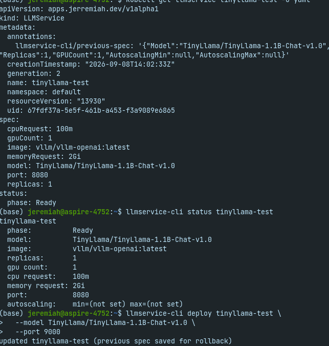

# llmservice-cli

A Cobra CLI for deploying, inspecting, and rolling back `LLMService`
resources — a custom Kubernetes CRD for serving LLMs via vLLM, reconciled
by [`llmservice-operator`](https://github.com/Jeremiah-Williams1/llmservice-operator).

A developer shouldn't need to hand-write CRD YAML to deploy, check, or
roll back a model. This CLI wraps that workflow into three commands:
`deploy`, `status`, `rollback`.

## Design: independent from the operator repo, on purpose

This repo does **not** import `llmservice-operator`'s Go types. It talks
to the cluster via `k8s.io/client-go/dynamic` against the CRD's
group/version/resource coordinates directly, working with
`unstructured.Unstructured` objects instead of a shared typed struct.

That means:
- No build-time dependency between the two repos — versioning,
  releasing, and testing each independently.
- The CRD's actual schema is the source of truth. See
  [`llmservice-operator`](https://github.com/Jeremiah-Williams1/llmservice-operator)'s
  `api/v1alpha1` package for the authoritative `LLMServiceSpec`
  definition if you're extending this CLI — `internal/llmservice/types.go`
  here is a **hand-maintained mirror** of that struct, not a generated
  or imported copy. If the operator's CRD schema changes, this repo's
  `Spec` struct and `convert.go` need manual updates to match — nothing
  catches that drift automatically. That's the real tradeoff of staying
  decoupled.

## Layout

```
llmservice-cli/
├── main.go                       — entry point, calls cmd.Execute()
├── cmd/
│   ├── root.go                   — shared --kubeconfig/--namespace flags,
│   │                                builds the dynamic client once via
│   │                                PersistentPreRunE
│   ├── deploy.go                 — create-or-update; snapshots the
│   │                                previous spec into an annotation
│   │                                before overwriting an existing resource
│   ├── status.go                 — prints spec + status.phase, with
│   │                                unset fields showing the CRD's actual
│   │                                default rather than a blank value
│   └── rollback.go                — reads the previous-spec annotation
│                                     and reapplies it (one level of undo,
│                                     not a revision history)
├── internal/
│   ├── k8s/
│   │   └── client.go              — kubeconfig → dynamic.Interface,
│   │                                 and the LLMServiceGVR constant
│   └── llmservice/
│       ├── types.go               — hand-mirrored Spec/Status structs
│       └── convert.go             — Spec ⇄ unstructured.Unstructured
└── cmd/*_test.go, internal/**/*_test.go — no cluster required; uses
    k8s.io/client-go/dynamic/fake for cmd package tests
```

## Install

```bash
go install .
```

Places the `llmservice-cli` binary in `$(go env GOPATH)/bin` — make sure
that's on your `PATH`.

## Usage

```bash
# First deploy — creates a new LLMService
llmservice-cli deploy my-model \
  --model TinyLlama/TinyLlama-1.1B-Chat-v1.0 \
  --gpu-count 1 \
  --replicas 1

# Re-running deploy on an existing name updates it, and saves the
# previous spec for rollback
llmservice-cli deploy my-model --gpu-count 2

# Inspect current spec + reconciler status
llmservice-cli status my-model

# Undo the last deploy (one level only)
llmservice-cli rollback my-model
```

`--kubeconfig` and `--namespace`/`-n` are available on every subcommand;
`--kubeconfig` defaults to `~/.kube/config` if omitted.

### Flag semantics worth knowing

Several `LLMService` spec fields are optional with CRD-side defaults
(`--image`, `--cpu-request`, `--memory-request`, `--port`) — leave them
unset to let the CRD's own default apply, rather than passing an empty
value. Others (`--replicas`, `--gpu-count`, `--autoscaling-min`,
`--autoscaling-max`) distinguish "not passed" from "explicitly passed as
0" — e.g. `--replicas 0` is a real, meaningful instruction, not the same
as omitting the flag.

## Rollback scope

Deliberately simple: `deploy` stores the spec it's about to overwrite as
a JSON annotation before applying the new one; `rollback` reads that
annotation, reapplies it, and clears it. This is **one level of undo**,
not a revision log — rolling back twice in a row without a `deploy` in
between will error with "nothing to roll back to," by design.

## Concurrency

`deploy` and `rollback` both wrap their Get→modify→Update sequence in
`client-go/util/retry.RetryOnConflict`, so a concurrent write from
another caller (or the reconciler itself) causes an automatic retry
against the fresh state, rather than an immediate failure.

## Testing

```bash
go test ./... -v
```

No live cluster required — `cmd` package tests use
`k8s.io/client-go/dynamic/fake` to simulate the API server in-memory;
`internal/k8s` and `internal/llmservice` tests are pure unit tests with
no cluster dependency at all.

## Test Images
### CLI Deploy Test


*Initial deployment of the `tinyllama-test` service using `llmservice-cli` with 1 GPU and 1 replica.*

---

### CLI Status


*Checking the deployment status of `tinyllama-test` and verifying the running pod using `kubectl get pods`.*

---

### Update on the CLI


*Updating the deployment configuration for `tinyllama-test` via the CLI to update the port configuration.*

---

### Kubernetes Resource Details & Update Test


*YAML specification output for the `LLMService` custom resource alongside status verification and port update execution.*

## Status

Validated end-to-end against a real AWS EKS cluster running
`llmservice-operator` and a real vLLM pod
(`TinyLlama/TinyLlama-1.1B-Chat-v1.0`) — `deploy`/`status` confirmed
against both the CLI's own output and raw `kubectl get llmservice -o
yaml`. Retry-on-conflict is implemented but not yet exercised under real
concurrent load.